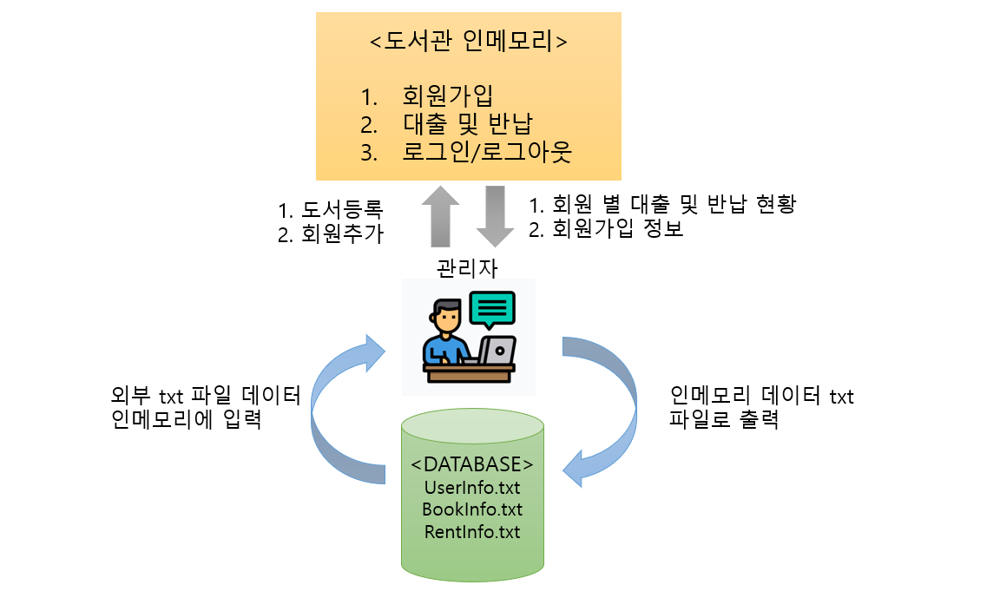

# 도서관리 프로젝트 

## 1. 프로젝트 개요 
### 1) 프로젝트 목적
JAVA로 도서관리 프로그램를 In-Memory와 File IO 두 가지 형식으로 나누어서 제작하기  
 

### 2) Concept 
도서관을 관리하는 관리자와 일반회원으로 나누어서 각각 필요로 하는 기능은 무엇일까 고민했습니다.  
 
#### 관리자
관리자는 개발자로부터 아이디와 비밀번호를 부여받으면 도서관리 프로그램에 로그인이 가능합니다.  
로그인 후 관리자는 가장 먼저 도서를 등록합니다. 도서가 등록되면 일반 회원을 그 도서를 대출 및 반납할 수 있게 됩니다.   
도서관 홈페이지가 운영되는 동안 인메모리에 신규회원가입 정보, 회원별 대출 및 반납 정보가 저장되고 관리자는 모든 정보를 관리자 페이지에서 조회할 수 있습니다.  
In-Memory의 경우 도서관 관리자가 프로그램을 종료하면 그 때까지 저장된 모든 데이터는 사라지지만 FIle IO의 경우에는 데이터를 외부장치에 저장할 수 있습니다.  
그러므로 관리자 페이지에 파일 저장 및 불러오는 기능을 추가합니다.  
 
#### 일반 회원
일반회원은 아이디, 비밀번호, 이름, 생년월일, 이메일 주소를 입력해 회원가입할 수 있습니다.   
각 회원에게 고유성을 부유하기 위해 아이디는 중복될 수 없습니다.  
회원가입이 완료되면 바로 로그인 페이지로 이동합니다  
로그인이 성공하면 도서검색, 도서대출 및 반납, 마이페이지에서 내 정보 수정 기능을 사용할 수 있습니다.  
 
### 3) 주요 기능
 
 
### 4) In-Memory와 File IO의 차이
 
 
## 2. 프로젝트 시연 
유튜브 동영상  
<iframe width="929" height="498" src="https://www.youtube.com/embed/X3diADDYE8o" title="YouTube video player" frameborder="0" allow="accelerometer; autoplay; clipboard-write; encrypted-media; gyroscope; picture-in-picture" allowfullscreen></iframe>  
 

## 3. 느낀점
프로젝트를 수행하며 자바 실력이 나날이 성장해가는게 느껴졌습니다.  
다양한 버그를 수정해 나가면서 데이터 구조에 대해 좀 더 자세히 알게 되었습니다.  
향후 프로그램 설계에 대해 더 공부해 나가고 싶습니다.  

